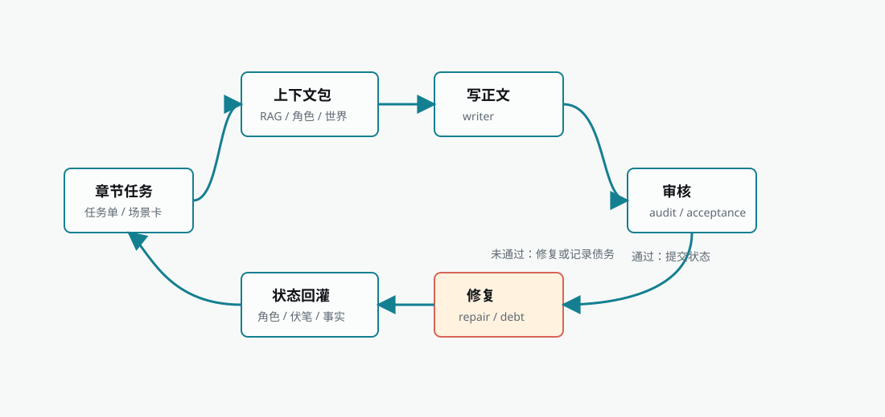

# Chapter Execution

Chapter execution turns a prepared chapter task into prose and feeds its stable
state into later chapters. It includes generation, review, repair, quality debt,
and state synchronization.

## Entry points

| Entry | Condition | Purpose |
| --- | --- | --- |
| Director chapter batch ready | Pacing, chapter list, and chapter detail are ready | Continue after confirmation or automatic approval |
| Manual chapter execution | A user starts from a chapter or Task Center | Retry one chapter, test a model, or repair a local range |

Both entries converge on the same chapter runtime. A chapter task should exist
before the writer runs.

## The chapter task

A task is a production contract, not only a title. It normally contains the
chapter purpose, the handoff from the previous chapter, the movement toward the
next chapter, scene cards, participants, conflict, required payoffs, and hard
constraints from the book contract and world state.

If the task is missing or vague, return to chapter detail instead of trying to
fix the prompt with an ad-hoc sentence.

## Runtime stages

| Stage | Input | Artifact | Recovery |
| --- | --- | --- | --- |
| Context assembly | Task, book contract, characters, world, retrieval, style, facts | Generation context package | Add missing assets or resume the director |
| Draft generation | Context package, model route, chapter goal | Draft prose | Retry once for empty output, then inspect model and input |
| Review | Draft, task, context | Audit report and open issues | Record quality debt when acceptance is unavailable |
| Repair | Draft, review issues, repair context | Repaired prose and repair record | Apply low-risk repair; escalate structural risk |
| State finalization | Final prose and review result | Continuity, character, and state updates | Retry synchronization without rewriting usable prose |
| Payoff synchronization | Prose, review, reader promises | Payoff and promise status | Retry the synchronization |
| Character resources | Prose and governance state | Resource, item, and relationship changes | Hold high-risk proposals for confirmation |

Every path that changes chapter text must finish through the timeline
finalization boundary. Repair, batch execution, and director continuation must
not create a second writer or bypass that boundary.

## Quality and continuation

A local issue can remain visible as quality debt while later chapters continue.
Only an explicit replan, unusable output, or runtime/data-safety failure should
pause the global chain.
