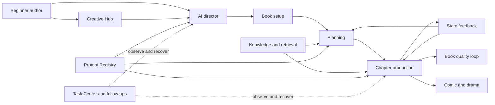

# Project Knowledge Graph

The knowledge graph routes questions to the narrowest source of truth. It does
not duplicate the public guides, Wiki contracts, or source code.

## How to use it

1. Use the [capability catalog](./capability-catalog.md) to find a product
   entry, backend owner, persistent asset, and deeper guide.
2. Use [question routing](./question-routing.md) to choose the smallest
   workflow or debugging path.
3. Use [source and license notes](./provenance.md) when checking copyright and
   attribution obligations.
4. Read the [project handbook](../project-handbook.md) for the complete novel
   production path.
5. Inspect current code, schema, and runtime state before treating a document
   as evidence of current behavior.

## System map

## Production invariant

A local chapter quality problem becomes repair work or quality debt. It does
not stop the global chain unless the structured decision requests a replan,
usable content is unavailable, or runtime and data safety are at risk.

## Evidence layers

| Question | First source |
| --- | --- |
| Where do I click? | `docs/public/` and current client routes |
| Why is it designed this way? | Durable Wiki and `AGENTS.md` |
| What is actually persisted? | Prisma schema, database records, and projections |
| How does a workflow recover? | Workflow Wiki, task state, and runtime code |
| What source and copyright notices apply? | Provenance, license, notice, and file-level evidence |

When documentation conflicts with code or runtime state, report the conflict and
use the current fact source. A plan proves that work was proposed, not that it
was implemented.

## Core owners

- Client entry points: `client/src/router/index.tsx`
- API mounting: `server/src/app.ts` and module `http/` folders
- Novel production: `server/src/services/novel/runtime/`
- AI director: `server/src/services/novel/director/`
- Prompt assets: `server/src/prompting/`
- Retrieval: `server/src/services/knowledge/` and `server/src/services/rag/`
- Task state: `server/src/services/task/` and director projections
- Persistence: the SQLite and PostgreSQL Prisma schemas

## Maintenance rules

Update the catalog when a product entry or owner changes. Update the relevant
Wiki contract when director, chapter production, recovery, prompt, retrieval,
model protocol, or task projection behavior changes. Keep temporary TODOs,
per-commit lists, and release narration out of this graph.
